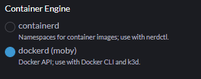
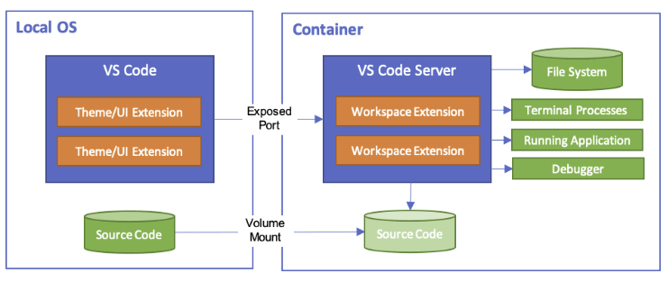
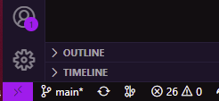
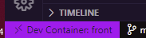

# node-devcontainer

node.js の開発環境を Visual Studio Code の Dev Containers を利用して実行するサンプル

## 環境作成

1. VSCode に [Remote Development](https://marketplace.visualstudio.com/items?itemName=ms-vscode-remote.vscode-remote-extensionpack) をインストール
1. Docker 環境がない場合は [Rancher Desktop](https://rancherdesktop.io/) をダウンロードしてインストール
   - インストール時には`Container Engine`を`dockerd(moby)`を選択する  
     
   - Kubernetes はオフで大丈夫

## 開発環境

VSCode の Remote Containers を利用して細かい環境差異が発生しないようにしています。  
Docker の中に VSCode やら node.js やらを入れてその中で開発を進めるナウい開発手法です。  
公式ドキュメント →(https://code.visualstudio.com/docs/devcontainers/containers)  
  
どんな設定になっているかは [devcontainer.json](https://github.com/shunsuke-kawai/node-devcontainer/blob/main/.devcontainer/devcontainer.json) を参照してください。

## 開発方法

- ローカル PC 上で本リポジトリをクローンもしくはダウンロードしてください。
- リポジトリを VSCode で開いてください。
- 左下にある><みたいなヤツを押してください。  
  
- `Reopen in Container` を選択するとコンテナが起動し、しばらくすると同じような VSCode が開きます。  
  さっきの><が DevContainer ってなってればコンテナ内で VSCode が動いているってことです。  
  
- Git のコミットとか Push はローカルで使い慣れたツール（SourceTree とか）を使ってもいいですし、DevContainer 内の VSCode にも Git 系の拡張機能は入れているのでそこでやってもいいです。（SSH キーは `%USERPROFILE%\.ssh` フォルダに置いてあるのを使うのでちがければコピーしてください。Mac は知らん。）

### うまく動かなかったら
- ロカールのターミナルで以下で一回全部消す  
`docker-compose down -v --rmi local --remove-orphans`  
- その後一回ローカルで立ち上げてみる  
`docker-compose up`  
- その後DevContainer起動  
`Reopen in Container`  
